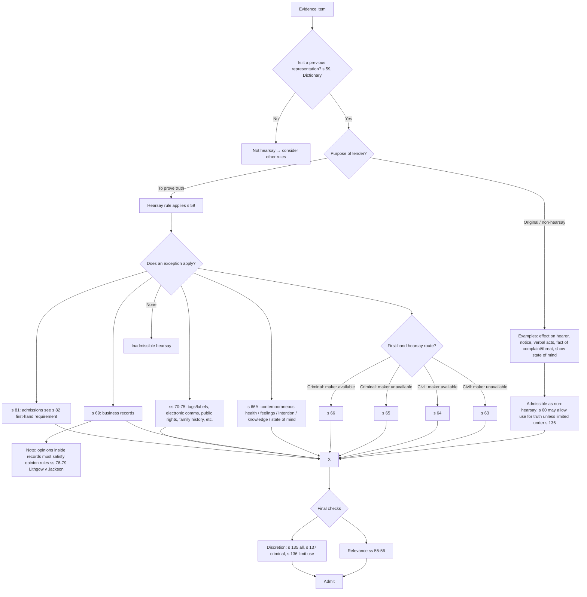

```mermaid
flowchart TD
 A[Evidence item] --> B{Is it a previous representation? s 59, Dictionary}
 B -- No --> Z1[Not hearsay → consider other rules]
 B -- Yes --> C{Purpose of tender?}
 %% Original non-hearsay purposes
 C -- Original / non-hearsay --> D1[Examples: effect on hearer, notice, verbal acts, fact of complaint/threat, show state of mind]
 D1 --> D2[Admissible as non-hearsay; s 60 may allow use for truth unless limited under s 136]
 %% Testimonial hearsay purposes
 C -- To prove truth --> E[Hearsay rule applies s 59]
 E --> F{Does an exception apply?}
 %% First-hand hearsay exceptions Div 2
 F --> G{First-hand hearsay route?}
 G -- Civil: maker unavailable --> G1[s 63]
 G -- Civil: maker available --> G2[s 64]
 G -- Criminal: maker unavailable --> G3[s 65]
 G -- Criminal: maker available --> G4[s 66]
 %% Other key exceptions
 F --> H[s 66A: contemporaneous health / feelings / intention / knowledge / state of mind]
 F --> I[s 69: business records]
 I --> I1[Note: opinions inside records must satisfy opinion rules ss 76-79 Lithgow v Jackson]
 F --> J[ss 70-75: tags/labels, electronic comms, public rights, family history, etc.]
 F --> K[s 81: admissions see s 82 first-hand requirement]
 F -- None --> N[Inadmissible hearsay]
 %% Funnel successful paths to final checks
 D2 --> X
 G1 --> X
 G2 --> X
 G3 --> X
 G4 --> X
 H --> X
 I --> X
 J --> X
 K --> X
 %% Final checks
 X --> Y{Final checks}
 Y --> Y1[Relevance ss 55-56]
 Y --> Y2[Discretion: s 135 all, s 137 criminal, s 136 limit use]
 Y1 --> Y3[Admit]
 Y2 --> Y3
```

